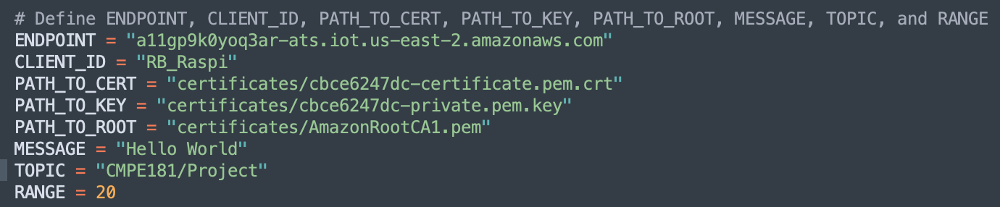

# Computer Engineering 181 Project
##  Members:
1. Ryan Biesty
2. Brandon Cheu
3. Casey Delaney

## Sensors:
Name   | Link
------ | -------------------------------------
DHT22 Temperature-Humidity Sensor | https://www.adafruit.com/product/393
STEMMA Soil Sensor | https://www.adafruit.com/product/4026

## Sample Code:
* DHT22: https://github.com/adafruit/Adafruit_CircuitPython_DHT/blob/master/examples/dht_simpletest.py
* STEMMA: https://github.com/adafruit/Adafruit_CircuitPython_seesaw/blob/master/examples/seesaw_soil_simpletest.py

## Schematic:


## Running the Project
* Setup Raspberry Pi and clone the repository.
* Go to the folder Code.
* Run the raspi-blinka.py to check, update, and install all the necessary libraries needed for the project.
```bash
pyclient % python3 raspi-blinka.py
```
* To test that the senors are functioning properly run read_sensors.py.
```bash
pyclient % python3 read_sensors.py
```
* Setup AWS Thing, Rules, IAM, DynamoDB, etc.
* Edit publish.py with your certificate name.

* Place or update certificates in the certificates folder.
* Run publish.py.
```bash
pyclient % python3 publish.py
```
* View published data via the AWS IoT Core Test > Subscribe to topic.
