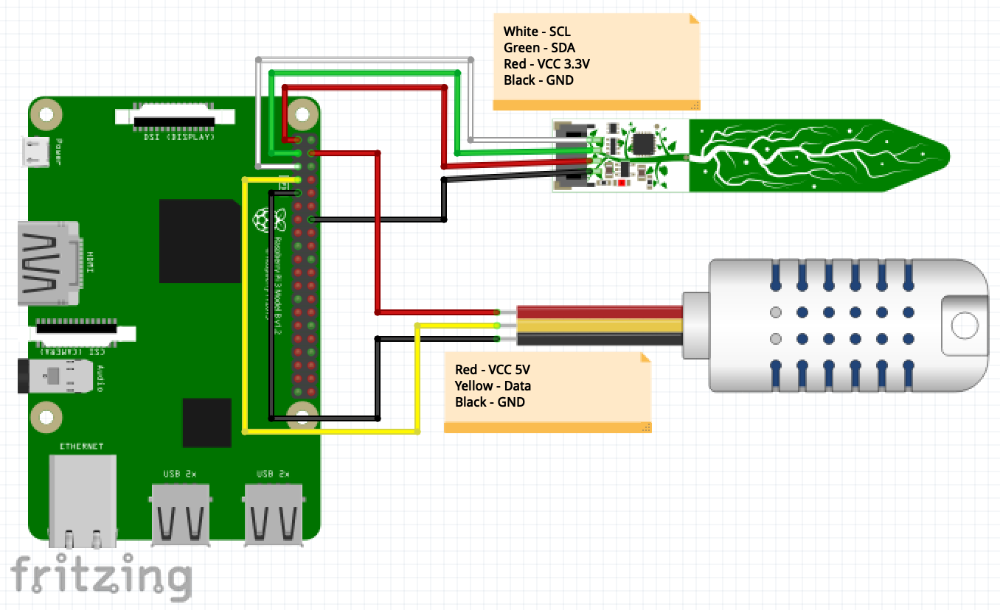

# Computer Engineering 181 Project
##  Members:
1. Ryan Biesty
2. Brandon Cheu
3. Casey Delaney

## Sensors:
Name   | Link
------ | -------------------------------------
DHT22 Temperature-Humidity Sensor | https://www.adafruit.com/product/393
STEMMA Soil Sensor | https://www.adafruit.com/product/4026

## Sample Code:
* DHT22: https://github.com/adafruit/Adafruit_CircuitPython_DHT/blob/master/examples/dht_simpletest.py
* STEMMA: https://github.com/adafruit/Adafruit_CircuitPython_seesaw/blob/master/examples/seesaw_soil_simpletest.py

## Schematic:

